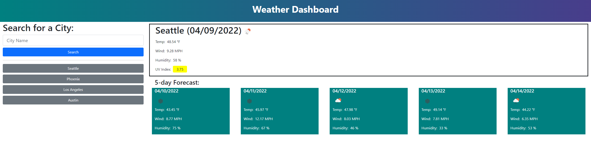

# weather-dashboard
# Chuan Wang
# Unit6 HW
Simple quiz site to show weather of cities using openweather api. 
Upon search show "No Search Results" if not found. 
If search is found, display the current weather info and a 5 day forecast. 
Weather is displayed as an icon and there is green/yellow/red background to reflect how good/bad the uvi is. 
Past searches are stored in localstorage and shown as clickable buttons below search form. 
Past searches will always be shown as latest search first and oldest last. 
When it is a duplicate search it will not create duplicate buttons, but will simply move it to the top. 
 
Here is what the site looks like: 

 
Here is a link to the deployed site: 
https://chuanw101.github.io/weather-dashboard/